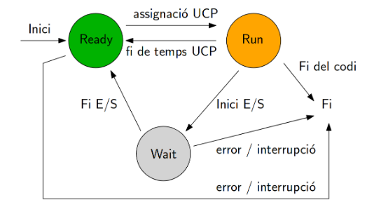

## Estats d'un Procés

Els processos poden passar per diversos estats, i la seva gestió és essencial per mantenir una execució ordenada i eficient.

### 1. Llest
En aquest estat, el procés està preparat per executar-se, però espera el seu torn en una cua d'execució.

### 2. Execució
Quan un procés està en estat d'execució, significa que s'està executant en la CPU. Aquesta és la fase activa del cicle de vida d'un procés.

### 3. Bloquejat
Els processos poden ser bloquejats quan esperen algun esdeveniment, com ara una entrada/sortida, per continuar la seva execució.

## Transició d'estats
